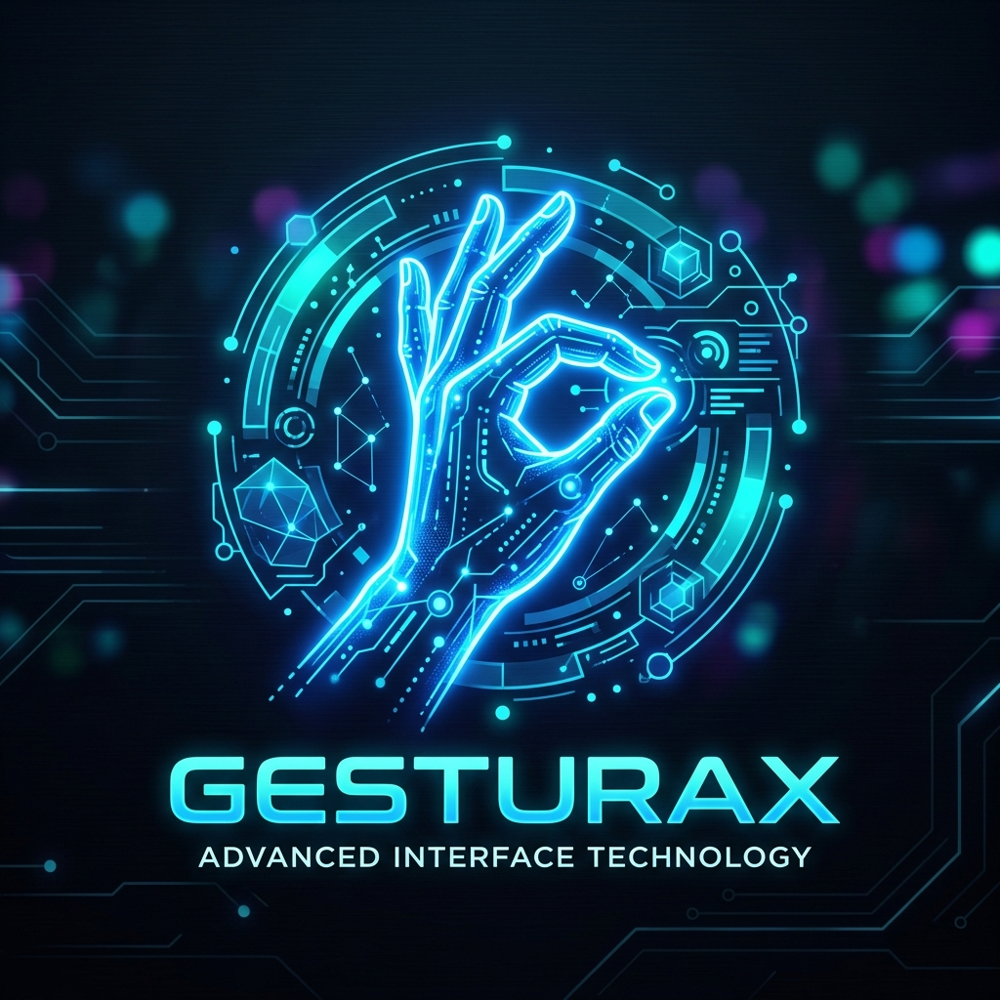

#  GESTURAX

[](https://opensource.org/licenses/MIT)
[](https://www.python.org/downloads/)
[](https://mediapipe.dev/)
[](https://socket.io/)

**GESTURAX** is a high-performance, AI-driven gesture control system that transforms your webcam into a sophisticated input device. Control your computer with natural hand movements—no extra hardware required.


---

## ✨ Key Features

- 🎯 **High-Precision Tracking**: Powered by Google's MediaPipe for robust hand landmark detection.
- ⚡ **Low-Latency Architecture**: Real-time communication via WebSockets (Socket.io) between the browser and your system.
- 🌊 **Adaptive Smoothing**: Intelligent exponential smoothing algorithms eliminate cursor jitter for a fluid experience.
- 🖥️ **Smart Scaling**: Maps a central "active zone" in the webcam feed to your full screen resolution, allowing effortless reach to every corner.
- 🎨 **Modern Dashboard**: A sleek, dark-themed glassmorphism interface providing real-time visual feedback and hand skeleton overlays.

---

## 🖐️ Gesture Mapping

| Gesture | Action | Description |
| :--- | :--- | :--- |
| **Index Finger** | 🖱️ **Move** | Point to move the mouse cursor across the screen. |
| **Index + Thumb Pinch** | 👆 **Left Click** | Bring thumb and index tips together to perform a click. |
| **Two Fingers Up** | 📜 **Scroll** | Raise index and middle fingers close together to enter scroll mode. |

---

## 🛠️ Technology Stack

- **Frontend**: 
  - HTML5 & CSS3 (Glassmorphism design)
  - JavaScript (Vanilla)
  - [MediaPipe Hands](https://google.github.io/mediapipe/solutions/hands)
  - [Socket.io-client](https://socket.io/docs/v4/client-api/)
- **Backend**:
  - Python 3.8+
  - [Flask](https://flask.palletsprojects.com/) & [Flask-SocketIO](https://flask-socketio.readthedocs.io/)
  - [PyAutoGUI](https://pyautogui.readthedocs.io/)

---

## 🚀 Getting Started

### 1. Prerequisites
Ensure you have Python installed. It is recommended to use a virtual environment.

### 2. Installation
Clone the repository and install the required dependencies:
```bash
git clone https://github.com/ameeraamii196-bot/GESTURAX.git
cd GESTURAX
pip install -r requirements.txt
```

### 3. Running the App
Start the backend server:
```bash
python app.py
```
Then, simply open `index.html` in your web browser (Chrome or Edge recommended).

---

## 🛡️ Safety & Failsafe
GESTURAX is designed with safety in mind. If at any point the cursor behaves unexpectedly or you lose control:
> [!IMPORTANT]  
> Move your physical mouse cursor to **any of the four corners of your screen** to trigger the PyAutoGUI failsafe and immediately stop the script.

---

## 📄 License
Distributed under the MIT License. See `LICENSE` for more information.

---
*Developed with ❤️ by Antigravity AI*